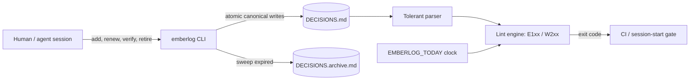

# emberlog

[English](README.md) | [中文](README.zh.md) | [日本語](README.ja.md)

[](LICENSE) [](CHANGELOG.md) [](pyproject.toml)  [](CONTRIBUTING.md)

**AI エージェントと長期プロジェクトのためのオープンソース意思決定ログ管理ツール——TTL と出所タグ付きのエントリを 1 つのプレーン Markdown ファイルで管理し、次のセッションが信じ込む前に期限切れリンターで知識の腐敗を捕まえる。**


```bash
git clone https://github.com/JaydenCJ/emberlog && cd emberlog && pip install -e .
```

> **プレリリース：** emberlog はまだ PyPI に公開されていません。初回リリースまでは [JaydenCJ/emberlog](https://github.com/JaydenCJ/emberlog) をクローンし、リポジトリのルートで `pip install -e .` を実行してください。

## なぜ emberlog？

長いプロジェクトには必ず `NOTES.md` が溜まっていく——下した決定、見つけた制約、すでに調べ尽くした袋小路——そしてエージェントのワークフローはそれを真実として読み返す。しかし知識は腐る：staging の癖は数か月前に直り、「たぶんキャッシュのせい」という推測は一度も確認されず、それを人間が決めたのかエージェントが深夜 2 時に推論したのか誰も覚えていない。記憶*インフラ*（ベクトルストア、Postgres メモリ、ホスト型リコール）が解くのは検索であって腐敗ではない：古びた主張も永遠に忠実に思い出してしまう。emberlog は腐敗そのものを、いま手元にあるファイルの中で叩く：全エントリが TTL と出所タグを持ち、知識が期限切れになればリンターが大声で落ち、掃除機能が死んだエントリをアーカイブへ移す。サーバーなし、データベースなし、モデルなし——どのフォージでも普通に描画され、どの PR でもきれいに diff できる 1 つの Markdown ファイルだけ。

|  | emberlog | 手作業の NOTES.md | pgmem | Letta (MemGPT) |
|---|---|---|---|---|
| 保存先 | git 内のプレーン Markdown | git 内のプレーン Markdown | Postgres | サーバー + DB |
| 知識がポリシーで失効する | エントリ毎 TTL + lint + 掃除 | しない（静かに腐る） | 想起時の減衰スコアリング | なし（編集/要約） |
| 主張ごとの出所 | `human:` / `agent:` / `doc:` + 確信度 | 書いた者勝ち | メタデータ列 | メッセージ履歴 |
| CI / セッション開始の失効ゲート | 終了コードで落ちるリンター | なし | なし | なし |
| 人が編集でき PR でレビューできる | はい、無損失ラウンドトリップ | はい | SQL | API |
| ランタイム依存 | 0 | 0 | Postgres + pgvector | サーバースタック |

<sub>各行の事実は 2026-07 時点：pgmem は Postgres 内部でクエリ時に時間減衰をスコアリングし、Letta は常駐エージェントサーバー経由で記憶を管理する。どちらも主張が古びてもビルドを落とさない——そのゲートこそ emberlog の仕事。emberlog の依存数は [pyproject.toml](pyproject.toml) の `dependencies = []` の通り。</sub>

## 特長

- **キャッシュだけでなく知識に TTL を** —— 各エントリに `45d`・`8w`・`6m`・`1y`、または明示的な `never` を設定；月の計算はカレンダー対応（1 月 31 日 + 1m = 2 月 28 日、翌月への溢れなし）。
- **重み付けできる出所** —— `source=agent:claude-code`、`human:alice`、`doc:runbook.md` を区別し、さらに `guess → inferred → observed → verified` の確信度の階梯；低確信度のエントリは TTL より速く腐る。
- **セッションと CI の門番になるリンター** —— 10 ルール（エラー 5・警告 5）、安定した終了コード、`--strict`、`--json`；セッション開始時に走らせれば、エージェントは腐ったログを信じることを拒む。
- **非破壊的な減衰** —— `sweep` が期限切れエントリを `status=` と `swept=` のスタンプ付きで `DECISIONS.archive.md` へ移動；履歴は grep 可能なまま、作業ファイルは小さく正しく保たれる。
- **プレーン Markdown、無損失ラウンドトリップ** —— メタデータは HTML コメントに隠れるのでファイルはどのフォージでも普通に描画；未知キーも手編集も打ち間違いすら、書き換えのたびにバイト単位で生き残る。
- **設計としての決定性** —— id は内容から導出、`EMBERLOG_TODAY` で時計を固定、書き込みはアトミック；ランタイム依存ゼロ、ネットワークは一切使わない。

## クイックスタート

インストールしたらログを作り、質のばらつく主張を 3 件与える：

```bash
emberlog init
emberlog add "Use SQLite for the job queue" --ttl 90d \
    --source agent:claude-code --confidence observed --tags storage
emberlog add "Staging resets its database every Monday" --ttl 45d \
    --source doc:docs/runbook.md --confidence observed
emberlog add "The flaky test is probably the cache" --ttl 14d --confidence guess
emberlog list
```

```text
ID      AGE  EXPIRES  CONF      SOURCE               TITLE
6e28c8  0d   in 90d   observed  agent:claude-code    Use SQLite for the job queue
be5c60  0d   in 45d   observed  doc:docs/runbook.md  Staging resets its database every Monday
650dba  0d   in 14d   guess     -                    The flaky test is probably the cache
```

7 週間後（再現性のため `EMBERLOG_TODAY=2026-09-01` で時計を固定）、同じファイルは lint に落ちる——実際に取得した出力：

```bash
emberlog lint
```

```text
DECISIONS.md:8: E101 expired: "Staging resets its database every Monday" expired 2026-08-27 (5d ago) — renew it, retire it, or run 'emberlog sweep'
DECISIONS.md:11: E101 expired: "The flaky test is probably the cache" expired 2026-07-27 (36d ago) — renew it, retire it, or run 'emberlog sweep'
DECISIONS.md:11: W203 no-provenance: "The flaky test is probably the cache" has no source= — future readers cannot weigh it
DECISIONS.md:11: W205 stale-unverified: "The flaky test is probably the cache" is still confidence=guess after 50d — verify it or retire it
DECISIONS.md: 4 findings (2 errors, 2 warnings)
```

終了コードは 1——`emberlog lint` を CI やセッション開始フックに繋げば、古びた知識は誤った意思決定ではなく赤いビルドになる。あとは片付けるだけ：

```bash
emberlog sweep    # expired entries -> DECISIONS.archive.md
emberlog lint     # DECISIONS.md: clean — 1 active entry, nothing stale
```

まだ成り立つエントリは `emberlog renew <id>` で更新；裏付けが取れた推測は `emberlog verify <id>`；覆った決定は `emberlog retire <id> --reason "..."` で撤収。あらゆる腐敗形態を収めた実例ログは [`examples/`](examples/) に、ファイル形式の仕様は [`docs/format.md`](docs/format.md) にある。

## Lint ルール

| コード | 重大度 | 発火条件 |
|---|---|---|
| E101 `expired` | エラー | エントリが計算上の失効日を過ぎている |
| E102 `malformed-entry` | エラー | ある `##` ブロックをエントリとして解析できない |
| E103 `duplicate-id` | エラー | 2 つのエントリが同じ id を共有している |
| E104 `bad-field` | エラー | メタデータ値が不正（原文のまま保持、削除しない） |
| E105 `expires-drift` | エラー | 保存された `expires=` が `added/renewed + ttl` と食い違う |
| W201 `expiring-soon` | 警告 | エントリが観測窓内に失効する（既定 14 日、`--horizon`） |
| W202 `no-ttl` | 警告 | エントリに `ttl=` がない——期限なしのメモは静かに腐る |
| W203 `no-provenance` | 警告 | エントリに `source=` タグがない |
| W204 `untyped-provenance` | 警告 | source に既知の `kind:` 接頭辞がない |
| W205 `stale-unverified` | 警告 | `guess`/`inferred` のエントリが減衰期限を超えて放置（既定 45 日、`--decay`） |

## コマンドリファレンス

| コマンド | 効果 |
|---|---|
| `init` / `add` / `list` / `show` / `stats` | 作成・追記・閲覧（読み取り系は `--json` 対応） |
| `lint [--strict] [--horizon N] [--decay N]` | 終了コード：0 クリーン、1 指摘あり、2 用法/解析エラー |
| `renew <id> [--ttl 90d]` | TTL の起点を今日に張り直す |
| `verify <id>` | 確信度 → `verified` にして日付を記録（TTL は*延びない*） |
| `retire <id> [--reason "..."]` | 主張をアーカイブへ撤収する |
| `sweep [--dry-run]` | 期限切れエントリをすべてアーカイブへ移す |

## 検証

このリポジトリは CI を一切同梱しない；上記の主張はすべてローカル実行で検証されている。このリポジトリのチェックアウトから再現できる：

```bash
pip install -e '.[dev]' && pytest && bash scripts/smoke.sh
```

出力（実際の実行から転記、`...` で省略）：

```text
92 passed in 2.46s
...
[stats] active:        1
SMOKE OK
```

## アーキテクチャ



## ロードマップ

- [x] Markdown 形式 v1、寛容で無損失なパーサー、TTL エンジン、出所タグ、10 の lint ルール、sweep/renew/verify/retire のライフサイクル、JSON 出力、決定的な時計（v0.1.0）
- [ ] PyPI 公開（`pip install emberlog`）
- [ ] `emberlog report` —— セッション前文にそのまま貼れる Markdown 健全性ダイジェスト
- [ ] git 連携の出所（`git blame` / コミッターから `--source auto`）
- [ ] 複数ファイルのログ（`emberlog lint docs/decisions/*.md`）とファイル横断の重複 id 検出

全リストは [open issues](https://github.com/JaydenCJ/emberlog/issues) を参照。

## コントリビュート

コントリビュート歓迎——まずは [good first issue](https://github.com/JaydenCJ/emberlog/issues?q=is%3Aissue+is%3Aopen+label%3A%22good+first+issue%22) から始めるか、[discussion](https://github.com/JaydenCJ/emberlog/discussions) を立ててほしい。開発環境の構築は [CONTRIBUTING.md](CONTRIBUTING.md) を参照。

## ライセンス

[MIT](LICENSE)
