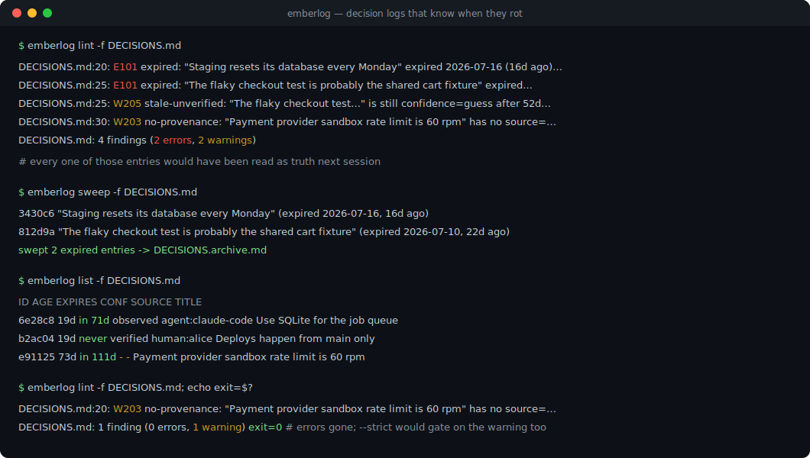
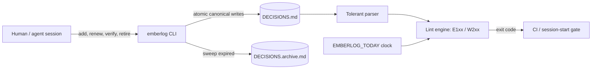

# emberlog

[English](README.md) | [中文](README.zh.md) | [日本語](README.ja.md)

[](LICENSE) [](CHANGELOG.md) [](pyproject.toml)  [](CONTRIBUTING.md)

**Open-source decision-log keeper for AI agents and long-running projects — TTL-stamped, provenance-tagged entries in one plain Markdown file, with an expiry linter that catches the rot before your next session trusts it.**



```bash
git clone https://github.com/JaydenCJ/emberlog && cd emberlog && pip install -e .
```

> **Pre-release:** emberlog is not yet published to PyPI. Until the first release, clone [JaydenCJ/emberlog](https://github.com/JaydenCJ/emberlog) and run `pip install -e .` from the repository root.

## Why emberlog?

Every long project accumulates a `NOTES.md` — decisions made, constraints discovered, dead ends already explored — and every agent workflow reads it back as ground truth. But knowledge decays: the staging quirk was fixed months ago, the "probably the cache" guess was never confirmed, and nobody remembers whether a human decided that or an agent inferred it at 2 a.m. Memory *infrastructure* (vector stores, Postgres memory, hosted recall) solves retrieval, not rot: it will faithfully recall a stale claim forever. emberlog attacks the rot itself, in the file you already have: every entry carries a TTL and a provenance tag, a linter fails loudly when knowledge expires, and a sweeper moves dead entries to an archive. No server, no database, no model — one Markdown file that renders on any forge and diffs cleanly in every PR.

|  | emberlog | hand-tended NOTES.md | pgmem | Letta (MemGPT) |
|---|---|---|---|---|
| Storage | plain Markdown in git | plain Markdown in git | Postgres | server + DB |
| Knowledge expires by policy | TTL per entry + lint + sweep | never (rots silently) | decay scoring on recall | no (edits/summarizes) |
| Provenance per claim | `human:` / `agent:` / `doc:` + confidence | whatever you type | metadata columns | message history |
| Expiry gate for CI / session start | exit-code linter | none | none | none |
| Human-editable, PR-reviewable | yes, lossless round-trip | yes | SQL | API |
| Runtime dependencies | 0 | 0 | Postgres + pgvector | server stack |

<sub>Row facts as of 2026-07: pgmem scores temporal decay at query time inside Postgres; Letta manages memory through a running agent server. Neither fails a build when a claim goes stale — that gate is emberlog's job. emberlog's dependency count is `dependencies = []` in [pyproject.toml](pyproject.toml).</sub>

## Features

- **TTLs on knowledge, not just caches** — every entry gets `45d`, `8w`, `6m`, `1y`, or an explicit `never`; month arithmetic is calendar-aware (Jan 31 + 1m = Feb 28, never a rollover).
- **Provenance you can weigh** — `source=agent:claude-code` vs `human:alice` vs `doc:runbook.md`, plus a `guess → inferred → observed → verified` confidence ladder; low-confidence entries decay faster than their TTL.
- **A linter that gates sessions and CI** — 10 rules (5 errors, 5 warnings), stable exit codes, `--strict`, `--json`; run it at session start so an agent refuses to trust a rotten log.
- **Non-destructive decay** — `sweep` moves expired entries to `DECISIONS.archive.md` with `status=` and `swept=` stamps; history stays greppable while the working file stays small and true.
- **Plain Markdown, lossless round-trip** — metadata hides in HTML comments so the file renders normally on any forge; unknown keys, hand edits, and even typos survive every rewrite byte-for-byte.
- **Deterministic by design** — ids derive from content, `EMBERLOG_TODAY` pins the clock, writes are atomic; zero runtime dependencies, no network, ever.

## Quickstart

Install, then start a log and feed it three claims of varying quality:

```bash
emberlog init
emberlog add "Use SQLite for the job queue" --ttl 90d \
    --source agent:claude-code --confidence observed --tags storage
emberlog add "Staging resets its database every Monday" --ttl 45d \
    --source doc:docs/runbook.md --confidence observed
emberlog add "The flaky test is probably the cache" --ttl 14d --confidence guess
emberlog list
```

```text
ID      AGE  EXPIRES  CONF      SOURCE               TITLE
6e28c8  0d   in 90d   observed  agent:claude-code    Use SQLite for the job queue
be5c60  0d   in 45d   observed  doc:docs/runbook.md  Staging resets its database every Monday
650dba  0d   in 14d   guess     -                    The flaky test is probably the cache
```

Seven weeks later (`EMBERLOG_TODAY=2026-09-01` pins the clock for reproducibility), the same file fails its lint — real captured output:

```bash
emberlog lint
```

```text
DECISIONS.md:8: E101 expired: "Staging resets its database every Monday" expired 2026-08-27 (5d ago) — renew it, retire it, or run 'emberlog sweep'
DECISIONS.md:11: E101 expired: "The flaky test is probably the cache" expired 2026-07-27 (36d ago) — renew it, retire it, or run 'emberlog sweep'
DECISIONS.md:11: W203 no-provenance: "The flaky test is probably the cache" has no source= — future readers cannot weigh it
DECISIONS.md:11: W205 stale-unverified: "The flaky test is probably the cache" is still confidence=guess after 50d — verify it or retire it
DECISIONS.md: 4 findings (2 errors, 2 warnings)
```

Exit code 1 — wire `emberlog lint` into CI or a session-start hook and stale knowledge becomes a red build instead of a wrong decision. Then clean up:

```bash
emberlog sweep    # expired entries -> DECISIONS.archive.md
emberlog lint     # DECISIONS.md: clean — 1 active entry, nothing stale
```

Entries that still hold get `emberlog renew <id>`; confirmed guesses get `emberlog verify <id>`; reversed decisions get `emberlog retire <id> --reason "..."`. A worked example log with every kind of rot lives in [`examples/`](examples/), and the file format is specified in [`docs/format.md`](docs/format.md).

## Lint rules

| Code | Severity | Fires when |
|---|---|---|
| E101 `expired` | error | entry is past its computed expiry date |
| E102 `malformed-entry` | error | a `##` block could not be parsed as an entry |
| E103 `duplicate-id` | error | two entries share the same id |
| E104 `bad-field` | error | a metadata value is invalid (kept verbatim, never deleted) |
| E105 `expires-drift` | error | stored `expires=` disagrees with `added/renewed + ttl` |
| W201 `expiring-soon` | warning | entry expires within the horizon (default 14d, `--horizon`) |
| W202 `no-ttl` | warning | entry has no `ttl=` — unbounded notes rot silently |
| W203 `no-provenance` | warning | entry has no `source=` tag |
| W204 `untyped-provenance` | warning | source lacks a known `kind:` prefix |
| W205 `stale-unverified` | warning | `guess`/`inferred` entry untouched past the decay age (default 45d, `--decay`) |

## Command reference

| Command | Effect |
|---|---|
| `init` / `add` / `list` / `show` / `stats` | create, append, and inspect (`--json` on the readers) |
| `lint [--strict] [--horizon N] [--decay N]` | exit 0 clean, 1 findings, 2 usage/parse error |
| `renew <id> [--ttl 90d]` | re-anchor the TTL at today |
| `verify <id>` | confidence → `verified`, dated today (does *not* extend the TTL) |
| `retire <id> [--reason "..."]` | withdraw a claim to the archive |
| `sweep [--dry-run]` | move every expired entry to the archive |

## Verification

This repository ships no CI; every claim above is verified by local runs. Reproduce them from a checkout of this repository:

```bash
pip install -e '.[dev]' && pytest && bash scripts/smoke.sh
```

Output (copied from a real run, truncated with `...`):

```text
92 passed in 2.46s
...
[stats] active:        1
SMOKE OK
```

## Architecture



## Roadmap

- [x] Markdown format v1, tolerant lossless parser, TTL engine, provenance tags, 10 lint rules, sweep/renew/verify/retire lifecycle, JSON output, deterministic clock (v0.1.0)
- [ ] PyPI release with `pip install emberlog`
- [ ] `emberlog report` — Markdown health digest for pasting into a session preamble
- [ ] Git-aware provenance (`--source auto` from `git blame` / committer)
- [ ] Multi-file logs (`emberlog lint docs/decisions/*.md`) with cross-file duplicate-id detection

See the [open issues](https://github.com/JaydenCJ/emberlog/issues) for the full list.

## Contributing

Contributions are welcome — start with a [good first issue](https://github.com/JaydenCJ/emberlog/issues?q=is%3Aissue+is%3Aopen+label%3A%22good+first+issue%22) or open a [discussion](https://github.com/JaydenCJ/emberlog/discussions). See [CONTRIBUTING.md](CONTRIBUTING.md) for the development setup.

## License

[MIT](LICENSE)
