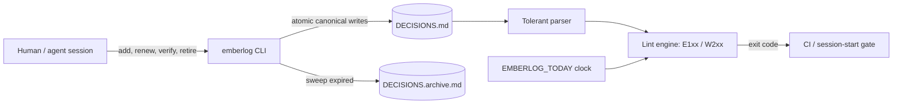

# emberlog

[English](README.md) | [中文](README.zh.md) | [日本語](README.ja.md)

[](LICENSE) [](CHANGELOG.md) [](pyproject.toml)  [](CONTRIBUTING.md)

**面向 AI 智能体与长期项目的开源决策日志管理器——在一个纯 Markdown 文件里维护带 TTL 时限、带来源标签的条目，并用过期 linter 在下一次会话轻信它之前揪出腐烂的知识。**


```bash
git clone https://github.com/JaydenCJ/emberlog && cd emberlog && pip install -e .
```

> **预发布：** emberlog 尚未发布到 PyPI。首个正式版之前，请克隆 [JaydenCJ/emberlog](https://github.com/JaydenCJ/emberlog) 并在仓库根目录执行 `pip install -e .`。

## 为什么选 emberlog？

每个长期项目都会攒出一份 `NOTES.md`——做过的决策、发现的约束、趟过的死胡同——而每个智能体工作流都把它当作事实来源读回去。但知识会腐烂：staging 的怪癖几个月前就修好了，"大概是缓存的锅"这个猜测从未被证实，也没人记得那条结论是人拍板的、还是智能体凌晨两点推断出来的。记忆*基础设施*（向量库、Postgres 记忆、托管召回）解决的是检索而不是腐烂：过期的断言它照样忠实地召回。emberlog 直接对付腐烂本身，就在你已有的文件里：每条条目带 TTL 和来源标签，知识过期时 linter 大声报错，清扫器把死条目移入归档。没有服务器、没有数据库、没有模型——只有一个在任何代码托管平台都能正常渲染、在每个 PR 里都能干净 diff 的 Markdown 文件。

|  | emberlog | 手工维护的 NOTES.md | pgmem | Letta (MemGPT) |
|---|---|---|---|---|
| 存储 | git 里的纯 Markdown | git 里的纯 Markdown | Postgres | 服务器 + 数据库 |
| 知识按策略过期 | 逐条 TTL + lint + 清扫 | 从不（无声腐烂） | 召回时按衰减打分 | 无（编辑/摘要） |
| 逐条断言的来源 | `human:` / `agent:` / `doc:` + 置信度 | 你随手写什么算什么 | 元数据列 | 消息历史 |
| CI / 会话启动的过期闸门 | 以退出码为闸的 linter | 无 | 无 | 无 |
| 人可编辑、可 PR 评审 | 是，无损往返 | 是 | SQL | API |
| 运行时依赖 | 0 | 0 | Postgres + pgvector | 服务器栈 |

<sub>各行事实截至 2026-07：pgmem 在 Postgres 内部于查询时做时间衰减打分；Letta 通过常驻智能体服务器管理记忆。二者都不会在断言过期时让构建失败——这道闸门正是 emberlog 的职责。emberlog 的依赖数即 [pyproject.toml](pyproject.toml) 中的 `dependencies = []`。</sub>

## 特性

- **给知识而不只是缓存上 TTL** —— 每条条目可设 `45d`、`8w`、`6m`、`1y` 或显式的 `never`；月份运算按日历感知（1 月 31 日 + 1m = 2 月 28 日，绝不溢出翻月）。
- **可以掂量的来源** —— `source=agent:claude-code`、`human:alice`、`doc:runbook.md` 各有分量，外加 `guess → inferred → observed → verified` 置信度阶梯；低置信度条目比其 TTL 腐烂得更快。
- **能把守会话与 CI 的 linter** —— 10 条规则（5 错误、5 警告），稳定退出码，`--strict`、`--json`；放在会话启动处运行，让智能体拒绝轻信一份腐烂的日志。
- **非破坏性的衰减** —— `sweep` 把过期条目移入 `DECISIONS.archive.md` 并盖上 `status=` 与 `swept=` 戳；历史仍可 grep，工作文件保持小而真。
- **纯 Markdown，无损往返** —— 元数据藏在 HTML 注释里，文件在任何平台照常渲染；未知键、手工修改乃至笔误都在每次重写后逐字节保留。
- **确定性即设计** —— id 由内容派生，`EMBERLOG_TODAY` 钉住时钟，写入原子化；零运行时依赖，永不联网。

## 快速上手

安装后建一份日志，喂给它三条质量参差的断言：

```bash
emberlog init
emberlog add "Use SQLite for the job queue" --ttl 90d \
    --source agent:claude-code --confidence observed --tags storage
emberlog add "Staging resets its database every Monday" --ttl 45d \
    --source doc:docs/runbook.md --confidence observed
emberlog add "The flaky test is probably the cache" --ttl 14d --confidence guess
emberlog list
```

```text
ID      AGE  EXPIRES  CONF      SOURCE               TITLE
6e28c8  0d   in 90d   observed  agent:claude-code    Use SQLite for the job queue
be5c60  0d   in 45d   observed  doc:docs/runbook.md  Staging resets its database every Monday
650dba  0d   in 14d   guess     -                    The flaky test is probably the cache
```

七周之后（用 `EMBERLOG_TODAY=2026-09-01` 钉住时钟以便复现），同一个文件 lint 不再通过——以下为真实捕获的输出：

```bash
emberlog lint
```

```text
DECISIONS.md:8: E101 expired: "Staging resets its database every Monday" expired 2026-08-27 (5d ago) — renew it, retire it, or run 'emberlog sweep'
DECISIONS.md:11: E101 expired: "The flaky test is probably the cache" expired 2026-07-27 (36d ago) — renew it, retire it, or run 'emberlog sweep'
DECISIONS.md:11: W203 no-provenance: "The flaky test is probably the cache" has no source= — future readers cannot weigh it
DECISIONS.md:11: W205 stale-unverified: "The flaky test is probably the cache" is still confidence=guess after 50d — verify it or retire it
DECISIONS.md: 4 findings (2 errors, 2 warnings)
```

退出码为 1——把 `emberlog lint` 接进 CI 或会话启动钩子，过期知识就从一次错误决策变成一次红色构建。然后清理：

```bash
emberlog sweep    # expired entries -> DECISIONS.archive.md
emberlog lint     # DECISIONS.md: clean — 1 active entry, nothing stale
```

仍然成立的条目用 `emberlog renew <id>` 续期；被证实的猜测用 `emberlog verify <id>`；被推翻的决策用 `emberlog retire <id> --reason "..."` 撤下。一份包含各种腐烂形态的示例日志见 [`examples/`](examples/)，文件格式规范见 [`docs/format.md`](docs/format.md)。

## Lint 规则

| 代码 | 级别 | 触发条件 |
|---|---|---|
| E101 `expired` | 错误 | 条目已过其计算出的到期日 |
| E102 `malformed-entry` | 错误 | 某个 `##` 块无法解析为条目 |
| E103 `duplicate-id` | 错误 | 两条条目共用同一个 id |
| E104 `bad-field` | 错误 | 某个元数据值非法（原样保留，绝不删除） |
| E105 `expires-drift` | 错误 | 存储的 `expires=` 与 `added/renewed + ttl` 不一致 |
| W201 `expiring-soon` | 警告 | 条目将在观察窗口内到期（默认 14 天，`--horizon`） |
| W202 `no-ttl` | 警告 | 条目没有 `ttl=`——无界的笔记会无声腐烂 |
| W203 `no-provenance` | 警告 | 条目没有 `source=` 标签 |
| W204 `untyped-provenance` | 警告 | 来源缺少已知的 `kind:` 前缀 |
| W205 `stale-unverified` | 警告 | `guess`/`inferred` 条目超过衰减期限未被触碰（默认 45 天，`--decay`） |

## 命令参考

| 命令 | 效果 |
|---|---|
| `init` / `add` / `list` / `show` / `stats` | 创建、追加与查看（读取类命令支持 `--json`） |
| `lint [--strict] [--horizon N] [--decay N]` | 退出码：0 干净，1 有发现，2 用法/解析错误 |
| `renew <id> [--ttl 90d]` | 把 TTL 重新锚定到今天 |
| `verify <id>` | 置信度 → `verified` 并记下日期（*不会*延长 TTL） |
| `retire <id> [--reason "..."]` | 把断言撤入归档 |
| `sweep [--dry-run]` | 把所有过期条目移入归档 |

## 验证

本仓库不携带任何 CI；上面每一条声明都由本地运行验证。在本仓库的检出中即可复现：

```bash
pip install -e '.[dev]' && pytest && bash scripts/smoke.sh
```

输出（摘自真实运行，以 `...` 截断）：

```text
92 passed in 2.46s
...
[stats] active:        1
SMOKE OK
```

## 架构



## 路线图

- [x] Markdown 格式 v1、容错无损解析器、TTL 引擎、来源标签、10 条 lint 规则、sweep/renew/verify/retire 生命周期、JSON 输出、确定性时钟（v0.1.0）
- [ ] 发布到 PyPI，支持 `pip install emberlog`
- [ ] `emberlog report` —— 可直接粘进会话前言的 Markdown 健康摘要
- [ ] 感知 git 的来源（由 `git blame` / 提交者生成 `--source auto`）
- [ ] 多文件日志（`emberlog lint docs/decisions/*.md`）及跨文件重复 id 检测

完整列表见 [open issues](https://github.com/JaydenCJ/emberlog/issues)。

## 参与贡献

欢迎贡献——可以从一个 [good first issue](https://github.com/JaydenCJ/emberlog/issues?q=is%3Aissue+is%3Aopen+label%3A%22good+first+issue%22) 入手，或发起一个 [discussion](https://github.com/JaydenCJ/emberlog/discussions)。开发环境搭建见 [CONTRIBUTING.md](CONTRIBUTING.md)。

## 许可证

[MIT](LICENSE)
